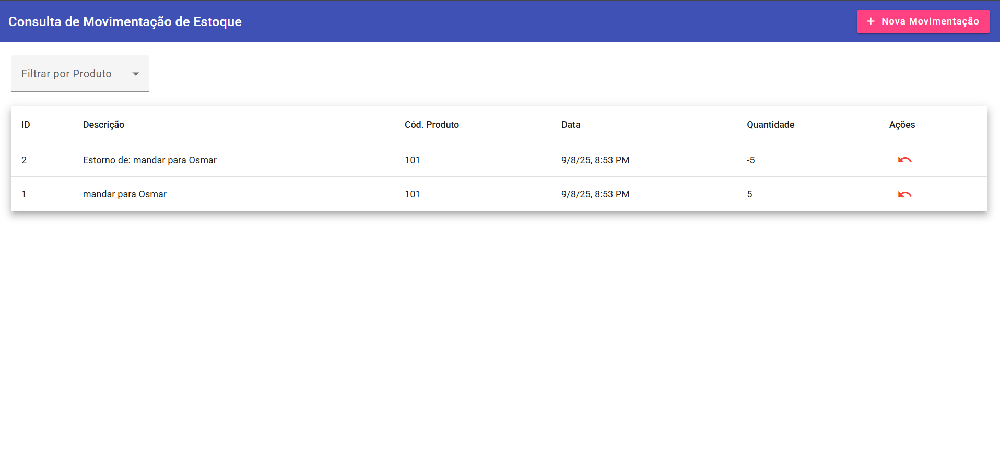

# Desafio Full Stack — Movimentações de Estoque

Este repositório contém um backend (.NET 8 + EF Core/SQLite) e um frontend (Angular 17 + Material) para:
- Consultar movimentações (com filtros por produto, data e tipo)
- Lançar movimentações (entrada/saída via quantidade positiva/negativa)
- Estornar movimentações (gera lançamento inverso)

## Como executar

Para rodar a aplicação completa (backend e frontend) utilizando Docker Compose, siga os passos abaixo:

1.  Certifique-se de ter o Docker e o Docker Compose instalados em sua máquina.
2.  No diretório raiz do projeto (`movimentacao_estoque`), execute o seguinte comando:

    ```bash
    docker compose up --build
    ```

    Este comando irá construir as imagens Docker para o backend e o frontend (se ainda não existirem ou se houver alterações) e iniciará os contêineres.

3.  Após os contêineres estarem em execução:
    *   O **Backend API** estará disponível em `http://localhost:5000` (Swagger em `/swagger`).
    *   O **Frontend** estará disponível em `http://localhost:4200`.


## Observações
- A lista de produtos vem do `backend/seed.json` conforme o JSON do desafio.
- O banco `app.db` é criado automaticamente (SQLite).

Bom teste! 🚀

A imagem abaixo mostra o resultado da aplicação em funcionamento.


